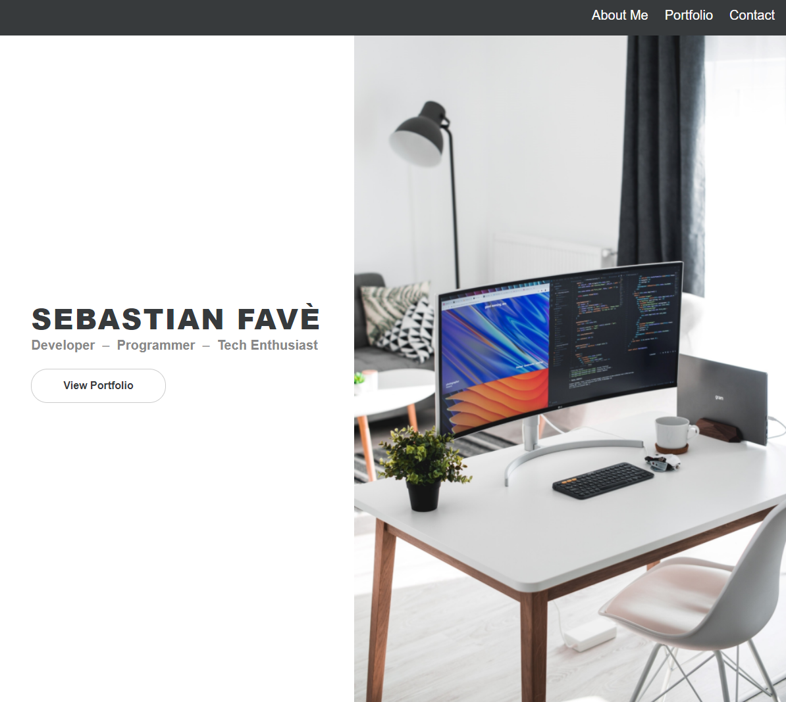

# **Personal Portfolio Website**

<!--  -->

&nbsp;
## **Description**
This repository holds the source files for the personal portfolio website of Sebastian Favè. 

&nbsp;
## **[Portfolio Website](https://spfave.github.io/portfolio_website/)**

&nbsp;
## **Technologies and Services**
Web Technologies/Design
- HTML5, CSS
- Responsive Design: flex and grid display

External Frameworks and Services
- [Font Awesome](https://fontawesome.com/)
- [Google Fonts](https://fonts.google.com/)

&nbsp;
## **Planned Future Improvements**
To-Dos:
- Contact form to complete email contact directly from website
- Collapsed side menu on mobile screen sizes
- Resolve landing section for mobile screen sizes in landscape orientation
- Implement a light and dark theme selection for the site 